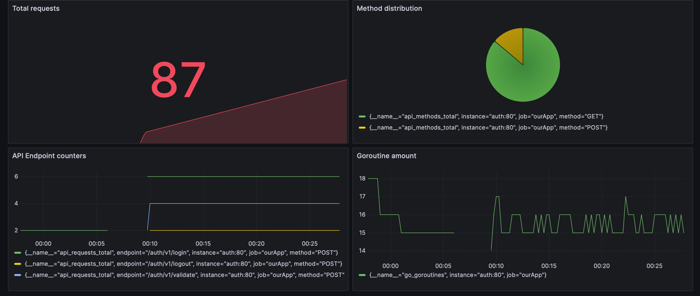

## Наблюдаемость в Go.
### Выполнил Киселев Иван Александрович

### Описание программы:
Программа по четверному домашнему заданию. 

- Чистая архитектура
- Сборка контейнеров с приложением и сервисами наблюдения

Дополнительно:
- Добавлена Postman API коллекция для импорта (API.Postman_collection.json)

Grafana:


### Запуск:
Как запускать:
- убедится что docker-compose.уaml и ./deployment/compose.уaml файл соответствует ожидаемым параметрам запуска
- Забилдить docker-compose (2 минуты)
```shell
 docker-compose -f docker-compose.yaml -f deployments/compose.yaml build
```
- Запустить его (30 секунд)
```shell
 docker-compose -f docker-compose.yaml -f deployments/compose.yaml up -d
```
- Сервер на 80 порту

### Комментарии:

Часть работы с логгированием и трассировкой происходит через контекст, 
такие данные по моему мнению допустим передавать неявно, так они идут отдельно от логики приложения
